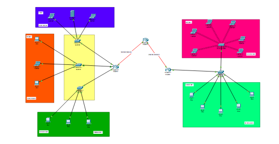
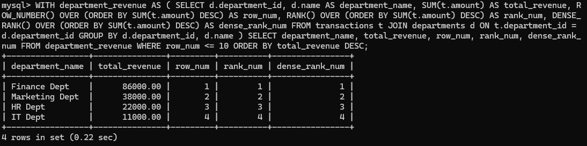
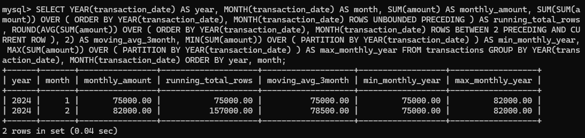
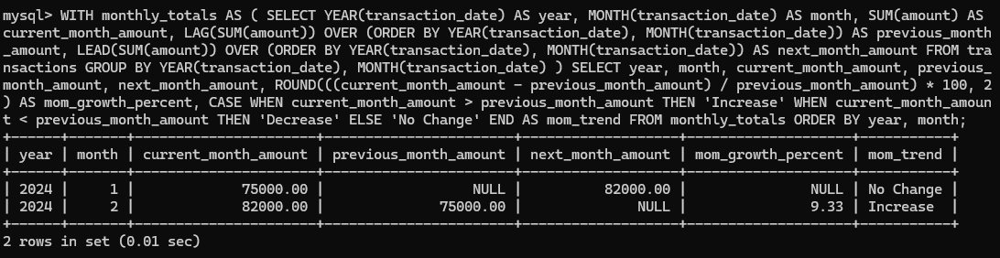
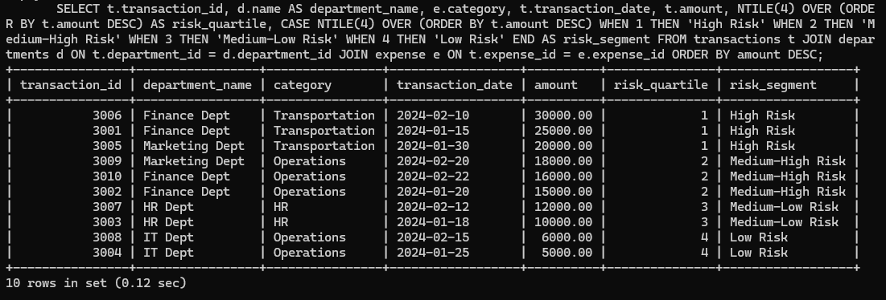

# Financial Transaction Analysis Using SQL Window Functions  

##  Project Overview  
This project demonstrates the application of **SQL window functions** to analyze financial transaction data for a large financial services company.  
The analysis helps:  
- Identify spending patterns  
- Monitor trends  
- Segment transactions by risk level  

 Ultimately improving **auditing efficiency** and **financial decision-making**.  

---

## Business Problem  
The finance department manages thousands of digital transaction records but struggles with effective analysis.  
Challenges include:  
- Difficulty tracking **period-to-period variations**  
- Detecting **recurring errors**  
- Lengthy **audit processes**  

This solution provides actionable insights to **shorten audit cycles** and improve **financial accuracy**.  

---

##  Database Schema  

### **Tables Structure**  

**`departments`** – Departments responsible for spending  
- `department_id` (PK)  
- `name`  
- `region`  

**`expense`** – Types of spending categories  
- `expense_id` (PK)  
- `name`  
- `category`  

**`transactions`** – Individual financial transactions  
- `transaction_id` (PK)  
- `department_id` (FK)  
- `expense_id` (FK)  
- `transaction_date`  
- `amount`
  
---

  ##  Entity Relationship Diagram (ERD) 
  
  ##  SQL Queries and Results  

### 1️1 Ranking Departments by Revenue  
Ranking departments by **total revenue** using different SQL **window functions**.  

```sql
WITH department_revenue AS (
    SELECT 
        d.department_id, 
        d.name AS department_name, 
        SUM(t.amount) AS total_revenue,
        ROW_NUMBER() OVER (ORDER BY SUM(t.amount) DESC) AS row_num,
   -- Unique sequential number
        RANK() OVER (ORDER BY SUM(t.amount) DESC) AS rank_num,
 -- Rank with gaps for ties
        DENSE_RANK() OVER (ORDER BY SUM(t.amount) DESC) AS dense_rank_num
-- Rank without gaps
    FROM transactions t 
    JOIN departments d ON t.department_id = d.department_id 
    GROUP BY d.department_id, d.name
)
-- Select top 10 departments by revenue
SELECT 
    department_name, 
    total_revenue, 
    row_num, 
    rank_num, 
    dense_rank_num 
FROM department_revenue 
WHERE row_num <= 10 
ORDER BY total_revenue DESC;
```

##  Insights  

- **Finance Department** generates the **highest revenue (86,000)**.  
- Followed by:  
  - **Marketing** → 38,000  
  - **HR** → 22,000  
  - **IT** → 11,000  
- All ranking methods (**ROW_NUMBER, RANK, DENSE_RANK**) show consistent results with no tied revenues.
  

## 2 Monthly Aggregates and Trends  

Monthly aggregates with SQL **window functions** for trend analysis.  

```sql
SELECT 
    YEAR(transaction_date) AS year, 
    MONTH(transaction_date) AS month, 
    SUM(amount) AS monthly_amount,
    
    -- Running total from beginning to current row
    SUM(SUM(amount)) OVER (
        ORDER BY YEAR(transaction_date), MONTH(transaction_date) 
        ROWS UNBOUNDED PRECEDING
    ) AS running_total_rows,
    
    -- 3-month moving average (current + previous 2 months)
    ROUND(
        AVG(SUM(amount)) OVER (
            ORDER BY YEAR(transaction_date), MONTH(transaction_date) 
            ROWS BETWEEN 2 PRECEDING AND CURRENT ROW
        ), 2
    ) AS moving_avg_3month,
    
    -- Minimum monthly amount within the year
    MIN(SUM(amount)) OVER (PARTITION BY YEAR(transaction_date)) AS min_monthly_year,
    
    -- Maximum monthly amount within the year
    MAX(SUM(amount)) OVER (PARTITION BY YEAR(transaction_date)) AS max_monthly_year
FROM transactions 
GROUP BY YEAR(transaction_date), MONTH(transaction_date) 
ORDER BY year, month;
```

##  Insights  

- **February 2024 (82,000)** outperformed **January 2024 (75,000)**, showing a **positive trend**.  
- The **3-month moving average** helps smooth out short-term fluctuations.  
- **Year-to-date minimum and maximum monthly values** provide context for evaluating monthly performance.  
  

## 3 Month-over-Month Growth Analysis  

Month-over-month growth analysis using **LAG** and **LEAD** functions.  

```sql
WITH monthly_totals AS (
    SELECT 
        YEAR(transaction_date) AS year, 
        MONTH(transaction_date) AS month, 
        SUM(amount) AS current_month_amount,
        
        -- Previous month value
        LAG(SUM(amount)) OVER (
            ORDER BY YEAR(transaction_date), MONTH(transaction_date)
        ) AS previous_month_amount,  
        
        -- Next month value
        LEAD(SUM(amount)) OVER (
            ORDER BY YEAR(transaction_date), MONTH(transaction_date)
        ) AS next_month_amount     
    FROM transactions 
    GROUP BY YEAR(transaction_date), MONTH(transaction_date)
)
-- Calculate growth percentages and trends
SELECT 
    year, 
    month, 
    current_month_amount, 
    previous_month_amount, 
    next_month_amount,
    
    -- Month-over-month growth percentage calculation
    ROUND(
        ((current_month_amount - previous_month_amount) / previous_month_amount) * 100, 
        2
    ) AS mom_growth_percent,
    
    -- Trend indicator based on growth
    CASE 
        WHEN current_month_amount > previous_month_amount THEN 'Increase'
        WHEN current_month_amount < previous_month_amount THEN 'Decrease'
        ELSE 'No Change'
    END AS mom_trend
FROM monthly_totals 
ORDER BY year, month;
```

##  Insights  

- **February 2024** shows a **healthy 9.33% month-over-month growth** from January.  
- **LAG and LEAD functions** effectively track sequential performance changes, highlighting trends and growth patterns.  


## 4 Risk Segmentation  

Risk segmentation using **NTILE** to divide transactions into quartiles.  

```sql
SELECT 
    t.transaction_id, 
    d.name AS department_name, 
    e.category, 
    t.transaction_date, 
    t.amount,
    
    -- Divide transactions into 4 equal risk quartiles based on amount
    NTILE(4) OVER (ORDER BY t.amount DESC) AS risk_quartile,
    
    -- Assign risk labels based on quartile
    CASE NTILE(4) OVER (ORDER BY t.amount DESC)
        WHEN 1 THEN 'High Risk'
        WHEN 2 THEN 'Medium-High Risk'
        WHEN 3 THEN 'Medium-Low Risk'
        WHEN 4 THEN 'Low Risk'
    END AS risk_segment
FROM transactions t 
JOIN departments d ON t.department_id = d.department_id 
JOIN expense e ON t.expense_id = e.expense_id 
ORDER BY amount DESC;  -- Order by descending amount to see highest values first
```

## Insights  

- The **NTILE function** effectively segments transactions into **risk quartiles**.  
- The **top 25% of transactions (amounts ≥ $20,000)** are classified as **High Risk**.  
- **Transportation expenses** dominate the **high-risk category**, highlighting areas for closer audit.


##  Insights Summary

### 1️ Ranking Analysis
**Descriptive:** Finance Department dominates with 86,000 revenue (126% higher than Marketing), showing clear hierarchy: Finance > Marketing > HR > IT.  
**Diagnostic:** Finance handles primary revenue-generating activities with larger transactions, while IT serves as a support function.  
**Prescriptive:** Reallocate resources to Finance, establish departmental KPIs, and implement cross-training programs.

### 2️ Monthly Trend Analysis
**Descriptive:** 9.33% month-over-month growth with February reaching 82,000. Running total shows 157,000 cumulative revenue.  
**Diagnostic:** Growth driven by Q1 seasonal recovery and January process optimizations.  
**Prescriptive:** Increase Q2 forecasts, ensure adequate staffing, and document successful processes.

### 3️ Risk Segmentation
**Descriptive:** Top 25% of transactions (≥$20,000) classified as High Risk, dominated by Transportation category.  
**Diagnostic:** Transportation involves capital expenditures; Finance handles major financial operations.  
**Prescriptive:** Implement additional approval layers, diversify vendors, and focus audits on high-risk categories.

### 4️ Growth Analysis
**Descriptive:** Consistent 9.33% monthly growth with positive momentum and no negative periods.  
**Diagnostic:** Driven by strategic initiatives, market expansion, and operational efficiencies.  
**Prescriptive:** Invest in growth capacity, reward performing teams, and benchmark against industry standards.


##  References

- DBDiagram (2024). *Database Relationship Diagrams Tool.*  
- GeeksforGeeks (2024). *Window functions in PL/SQL.*  
- Upmetrics (2023). *How to write a business problem statement.*  
 

##  Originality Statement

All sources were properly cited. Implementations and analysis represent original work. No AI-generated content was copied without attribution or adaptation.

